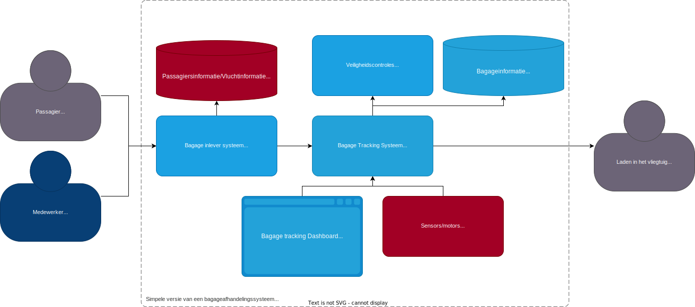

# Secure-solution bagageafhandelingsysteem POC

## Inleiding
Dit is een proof of concept voor een bagageafhandelingssysteem (en het beveligen ervan) voor de secure-solution.

## architectuur
De architectuur van het systeem is als volgt:

De rode objecten vallen buiten de scope. Want die zijn te groot om te implementeren in een POC met als doel het beveiligen van het systeem.

### Bagage Tracking Systeem
> [/bagage-tracking-systeem](/bagage-tracking-systeem)

Dit is een simpele python (flask) api die de bagage bijhoudt. De bagage wordt nu opgeslagen in een sqlite database. het gebruikt websockets om veranderingen in de database door te geven aan de clients/front-end.

### Bagage Tracking Systeem Front-end
> [/bagage-tracking-frontend](/bagage-tracking-frontend)

Dit is een simpele react app die de status en locatie bagage weergeeft. Het gebruikt websockets om veranderingen in de database door te krijgen van de server.

### Bagage Inlever Systeem
> TODO

> Een front-end dat bagage aanneemt van passagiers en deze in het Bagage Tracking Systeem zet.

## Beveiliging
