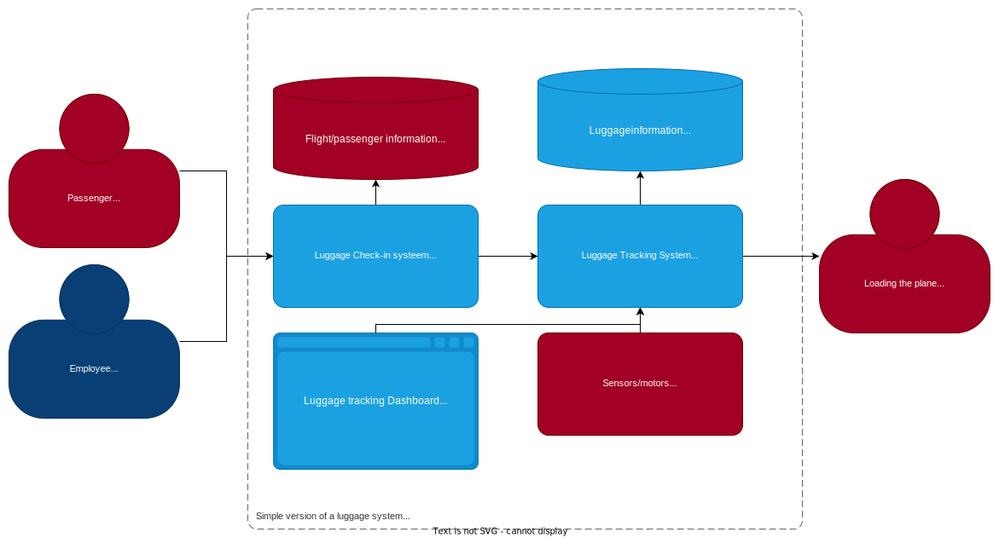
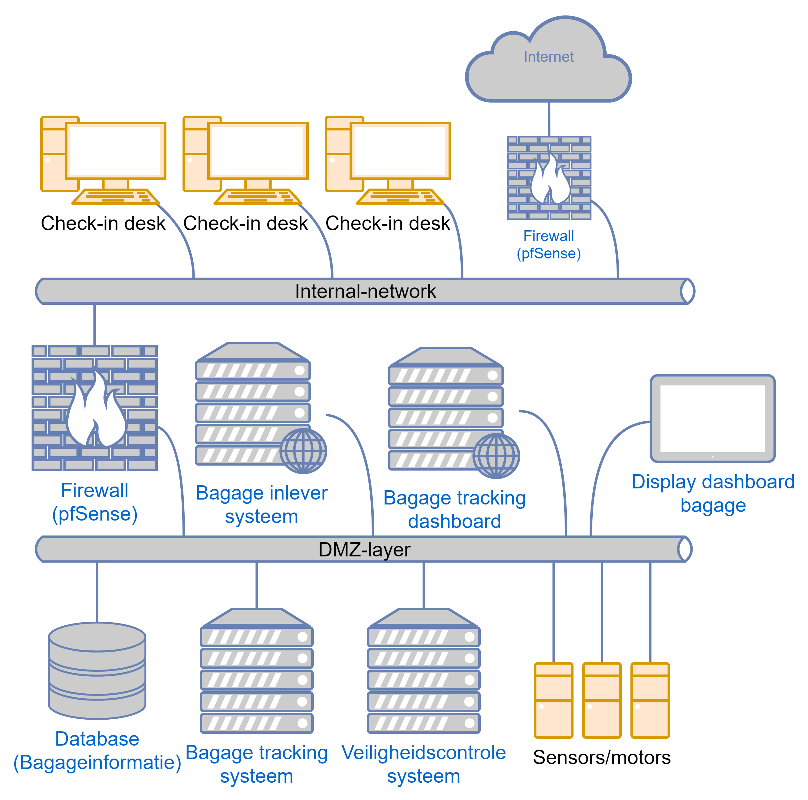

# Secure-solution baggage handling system POC

**See [TODO.md](/TODO.md) for the list of things that still need to be done.**

## Introduction

This is a proof of concept for a baggage handling system (with a focus on securing it) for the secure-solution.

It is a simple implementation of a baggage handling system with a baggage tracking system and a baggage check-in system.

## Architecture

The architecture of the system is as follows:

**The red objects are outside the scope** because they are too large to be implemented in this POC. Therefore, they will be simulated, hardcoded, or omitted.

### Baggage Tracking System (Python, Flask)

> [/bagage-tracking-systeem](/bagage-tracking-systeem)

This is a simple Python (Flask) API that tracks the baggage. The baggage is currently stored in a MySQL server. It uses websockets to communicate changes in the database to the clients/front-end.

### Baggage Tracking System Front-end (React)

> [/bagage-tracking-frontend](/bagage-tracking-frontend)

This is a simple React app that displays the status and location of the baggage. It uses websockets to receive changes in the database from the server.

### Baggage Check-in System (Express, Node.js)

> [/bagage-inlever-systeem](/bagage-inlever-systeem)

This is an API with a simple front-end that accepts baggage from passengers and puts it into the Baggage Tracking System.

It sends a POST request to the Baggage Tracking System to add the baggage.

### Security Control System

> **TODO**

## Network Diagram

> **The orange objects** (Check-in desk, sensors/motors) are objects that are likely to appear more frequently in a real system. There are multiple check-in desks and multiple sensors/motors.

This diagram is a simplified representation of the network (excluding passenger information, as it is outside the scope of this POC).

The Baggage Check-in System has a connection with the Check-in desks, so a firewall rule needs to be set up for that.

## Security Measures List

### General

- Separation by firewalls (see network diagram)

### Baggage Tracking System/Front-end

> [/bagage-tracking-systeem](/bagage-tracking-systeem), [/bagage-tracking-frontend](/bagage-tracking-frontend)

- Prepared statements (against SQL injection)

### Baggage Check-in System

> [/bagage-inlever-systeem](/bagage-inlever-systeem)

> TODO:
>
> Rate limiting per check-in desk (against brute force attacks)

## Explanation of Security Measures

> TODO: Explain each measure we have taken (and why)