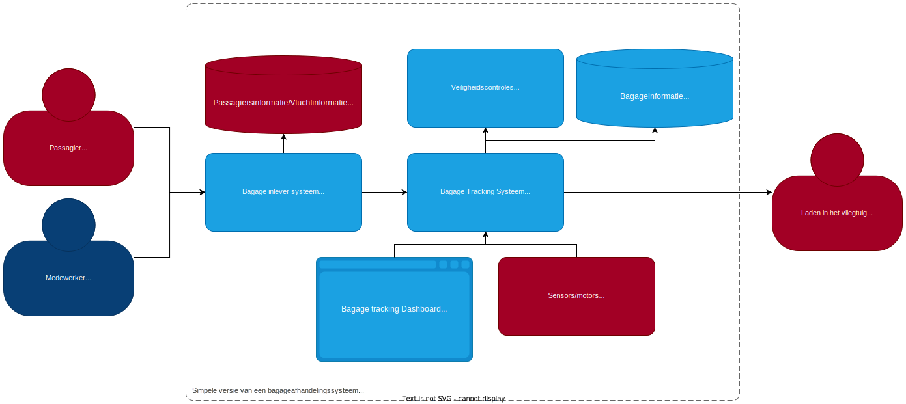

# Secure-solution bagageafhandelingsysteem POC

## Inleiding

Dit is een proof of concept voor een bagageafhandelingssysteem (en vooral het beveligen ervan) voor de secure-solution.

Het is een simpele implementatie van een bagageafhandelingssysteem met een bagage tracking systeem en een bagage inlever systeem.

## architectuur

De architectuur van het systeem is als volgt:

**De rode objecten vallen buiten de scope**. Want die zijn te groot om te implementeren in deze POC. Dus die worden gesimuleerd, hardcoded of weggelaten.

## netwerk tekening

> **De oranje objecten** (Check-in desk, sensors/motors) zijn objecten die waarschijnlijk in een echt systeem vaker voor zullen komen. Omdat er meerdere check-in desks zijn en meerdere sensors/motors.

Deze tekening is een simpele weergave van het netwerk. (zonder de passagiersinfo want die valt buiten de scope van deze POC)

Het bagage inlever systeem heeft een connectie met de Check-in desks dus daar moet een rule voor komen in de firewall.

### Bagage Tracking Systeem (Python, Flask)

> [/bagage-tracking-systeem](/bagage-tracking-systeem)
>
> **TODO**: Database apart hosten i.p.v. met sqlite (want dat is niet realistisch)

Dit is een simpele python (flask) api die de bagage bijhoudt. De bagage wordt nu opgeslagen in een sqlite database. het gebruikt websockets om veranderingen in de database door te geven aan de clients/front-end.

### Bagage Tracking Systeem Front-end (React)

> [/bagage-tracking-frontend](/bagage-tracking-frontend)

Dit is een simpele react app die de status en locatie bagage weergeeft. Het gebruikt websockets om veranderingen in de database door te krijgen van de server.

### Bagage Inlever Systeem (Express, Node.js)

> [/bagage-inlever-systeem](/bagage-inlever-systeem)

Dit is een API met simpele front-end dat bagage aanneemt van passagiers en deze in het Bagage Tracking Systeem zet.

Het stuurt een post request naar het Bagage Tracking Systeem om de bagage toe te voegen.

## Beveilingsmaatregelen lijst

### Algemeen

- [ ] HTTPS
- [ ] separatie door firewalls (netwerk tekening maken en uitleggen)
- [ ] logging

### Bagage Tracking Systeem/front-end

> [/bagage-tracking-systeem](/bagage-tracking-systeem), [/bagage-tracking-frontend](/bagage-tracking-frontend)

- [x] Prepared statements (tegen SQL injection)

### Bagage Inlever Systeem

> [/bagage-inlever-systeem](/bagage-inlever-systeem)

- [ ] Rate limiting per incheck-balie (tegen brute force attacks)

## Beveilingsmaatregelen uitleg

### SQL injection (Bagage Tracking Systeem)

> TODO: uitleggen

### Rate limiting

> TODO: uitleggen en implementeren
